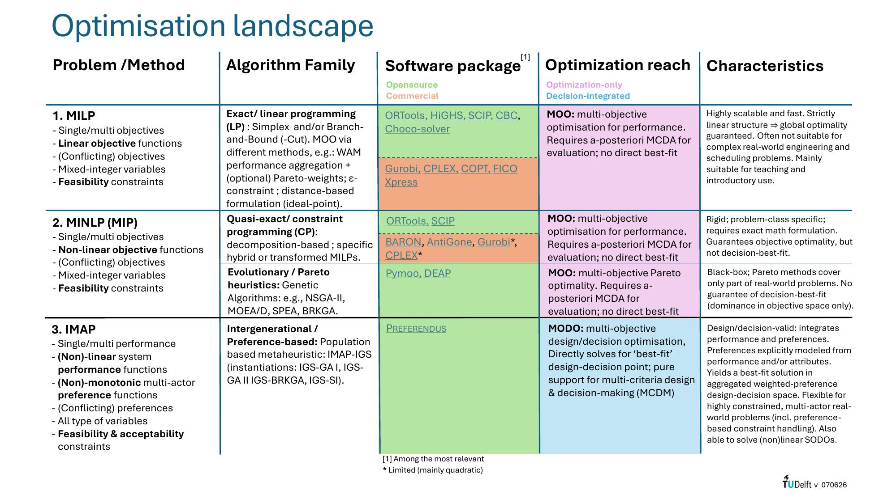

# TUDelft-IMAP-IGS

**Preference-Based Optimisation - IMAP Inter-Generational Solver (IGS) Framework**

---

## About

This is the home of the **IMAP Inter-Generational Solver (IGS)** framework - a collection of preference-based optimisation solvers built on the IMAP (Integrative Maximisation of Aggregated Preferences) aggregator. The organisation hosts four repositories, each a distinct IGS instantiation targeting different problem classes: **IGS-GA-I**, **IGS-GA-II**, **IGS-BRKGA**, and **IGS-SI**.

Earlier work, including the original open-source **Preferendus** package and the first IMAP demonstrator (floating wind farm, described in Chapter 8.5 of the ODESYS book), can be found at [TUDelft-Odesys](https://github.com/TUDelft-Odesys).

---

## Repositories

### [`IGS-GA-I`](https://github.com/TUDelft-IMAP-IGS/IGS-GA-I)
The original IGS-GA algorithm - the foundational **Inter-Generational Solver** using a Genetic Algorithm backbone. This is a user-friendly implementation, equivalent to the original version linked to all ODESYS book examples. It integrates IMAP preference aggregation directly into standard GA survival selection.

### [`IGS-GA-II`](https://github.com/TUDelft-IMAP-IGS/IGS-GA-II)
An improvement on IGS-GA-I, built on the **NSGA-II** genetic loop (crossover, mutation, mating) but replacing non-dominated sorting and crowding distance with **IMAP affine aggregation** survival. Designed for benchmarking against reference test suites (e.g. DAS-CMOP). Supports multi-stakeholder preference models, constraint handling via the Constraint Dominance Principle (CDP), tournament and truncation selection, and an optional cross-generation archive to stabilise IMAP Z-score normalisation.

### [`IGS-BRKGA`](https://github.com/TUDelft-IMAP-IGS/IGS-BRKGA)
A **Biased Random-Key Genetic Algorithm (BRKGA)** instantiation of the IMAP-IGS framework, developed for combinatorial and constraint-heavy problems. Used as the solver for the Heterogeneous Vessel Allocation and Scheduling Problem (HVASP).

### [`IGS-SI`](https://github.com/TUDelft-IMAP-IGS/IGS-SI)
A **Swarm Intelligence (SI)** instantiation of the IMAP-IGS framework, targeting graph-based and routing optimisation problems. Implements the Preferendus method via Ant Colony Optimisation (ACO), with the same preference-aggregation interface as the GA-based solvers. Applicable to directed graph problems such as route planning and Markov-chain modelling.

---

## Framework Overview

All IGS solvers share the same **IMAP (Integrative Maximisation of Aggregated Preferences)** aggregator:

1. Raw objective values are converted into preference scores (0-100) via stakeholder-defined preference functions.
2. Scores are Z-score-normalised across the current candidate pool.
3. A weighted sum P\* is computed over all criteria and stakeholders.
4. P\* is min-max-scaled to [0, 100] to produce the final ranking.

Because normalisation is pool-relative, IMAP scores are generation-specific.

For an overview of how IMAP relates to other optimisation methods (MILP, MINLP, Pareto/evolutionary approaches), see [`Optimisation landscape.pdf`](./Optimisation_landscape.pdf) included in this repository. For full terminology and formal definitions, see [`TUDelft-IMAP-IGS_overview.pdf`](./TUDelft-IMAP-IGS_overview.pdf).

---

## References

- Wolfert, A.R.M. (Rogier) et al. (2023). *Open Design Systems (ODESYS)*. TU Delft.  
  Repository: https://github.com/TUDelft-Odesys

- Woflert, A.R.M. (Rogier) (2026). *Unique Preference Aggregation in Design and Decision Making*. TU Delft.
  https://doi.org/10.48550/arXiv.2601.19759

- Timp, L.J.K. (Lennard). *Solving Highly Constrained Multi-Objective Decision Problems with Preference-Guided Metaheuristics: The IMAP-IGS Framework*
  To be published.

---

## License

This project is licensed under the **MIT License** - see the [`LICENSE`](./LICENSE) file for details.

Copyright (c) 2026 TUDelft-IMAP-IGS Contributors
